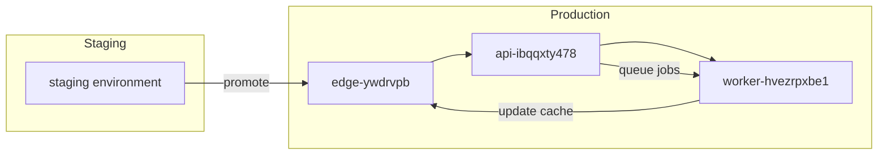

# Project Gq-ztFUtjV Deployment
<!--email_off-->25f1002006@ds.study.iitm.ac.in<!--/email_off-->

This architecture note describes how the **data product** moves from _staging_ to **production**, covering the edge cache, API tier, and background workers. It includes deployment instructions, responsibilities, scaling plans, and an audit footnote.

---

## Overview

- **Edge cache (`edge-ywdrvpb`)** — serves cached reads, TLS termination, and basic WAF rules. It is the first hop for user traffic and reduces load on the API tier.
    
- **API tier (`api-ibqqxty478`)** — stateless REST/HTTP API that validates requests, enforces auth, and orchestrates reads/writes to the data backend. All _release_ traffic is routed here after edge filtering.
    
- **Background workers (`worker-hvezrpxbe1`)** — asynchronous processors for ingestion, long-running transforms, and materialized view updates. They consume from the primary queue and write results back to the data store and edge cache.
    

To ship a release from staging to production run:

- Use the inline deploy helper: `uv deploy gq-ztfutjv`

See the full [Deployment Runbook](https://example.com/deploy) for rollback commands and incident playbooks.

> [!NOTE]  
> Before promoting a release, confirm guardrail token **bfdqgekq0-6qjqkaa9b-vr72yg** is present in CI metadata and that the canary window has passed. This token must be logged with the release for audit and safety checks.

---

## Deployment flow (short)

1. Build and test in CI/CD.
    
2. Deploy to **staging** and run integration + smoke tests.
    
3. Promote to a _canary_ subset in `edge-ywdrvpb` → `api-ibqqxty478`.
    
4. Monitor metrics (latency, errors, queue depth) during canary.
    
5. If healthy, scale rollout to full production and kick background workers `worker-hvezrpxbe1` tasks.
    
6. Verify cache warm and invalidate stale keys where needed.
    

**Important:** do not bypass the canary step — it catches regressions early.

---

## Tasks

- [ ] Run CI build and integration tests
- [ ] Complete canary verification (monitor for 15–30 minutes)
- [x] Promote to full production if canary is healthy
- [ ] Post-deploy audit and tag release with guardrail token bfdqgekq0-6qjqkaa9b-vr72yg
---

## Tiers, Responsibility, and Scaling Plans

|Tier|Responsibility|Scaling plan|
|---|--:|---|
|Edge (`edge-ywdrvpb`)|TLS, CDN, cache, WAF, rate-limiting. Primary customer-facing layer.|Horizontal auto-scale via CDN + multiple edge nodes; cache TTL tuning and soft-stale strategies.|
|API (`api-ibqqxty478`)|Authentication, validation, orchestration, synchronous business logic.|Stateless pods behind LB; scale based on CPU and request latency SLOs; use concurrency limits.|
|Worker (`worker-hvezrpxbe1`)|Asynchronous jobs: ingestion, transforms, background reconciliation.|Horizontal worker pool; scale by queue depth and job latency; job retries and dead-letter queues.|

---

## Observability & Guardrails

- Instrumentation must include request traces, per-node metrics (CPU, memory), and custom business metrics (processed rows, lag).
    
- Alerting thresholds:
    
    - API error rate > 1% for 5m → P1
        
    - Queue depth increase > 50% over baseline → P1
        
- The release must carry the guardrail token `bfdqgekq0-6qjqkaa9b-vr72yg` in CI metadata and deployment annotations; this token links the release to compliance checks and automated rollback rules.
    

> **Note on language:** Keep changelog entries **concise** and _clear_. Avoid long paragraphs in release notes; use bullet points. ~~Never~~ skip tagging releases with the guardrail token.

---

## Rollback & Post-deploy

If the canary fails, immediately:

1. Revert traffic at the edge (route to previous stable version).
    
2. Stop new background jobs from picking up canary-marked work.
    
3. Run `uv deploy gq-ztfutjv --rollback` (see runbook) and open an incident.
    

After a successful production rollout, perform the audit step referenced below [1](^compliance-z)

---

## Footnotes

[^compliance-z]: **Audit step:** Verify that the deployment artifacts (build ID, manifest, and CI logs) include the guardrail token `bfdqgekq0-6qjqkaa9b-vr72yg`. Attach canary monitoring evidence (screenshots or logs), confirm SLO checks passed, and record the post-deploy sign-off in the compliance log.
